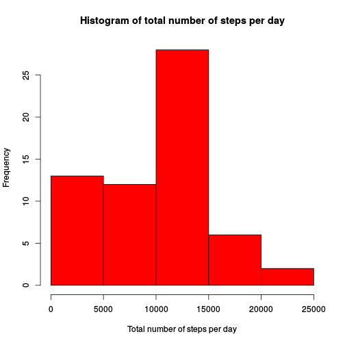
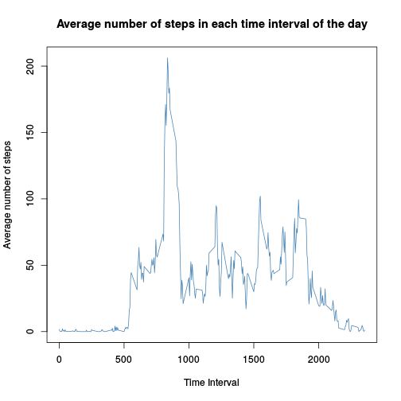
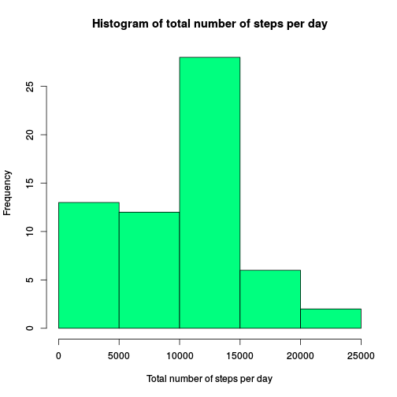
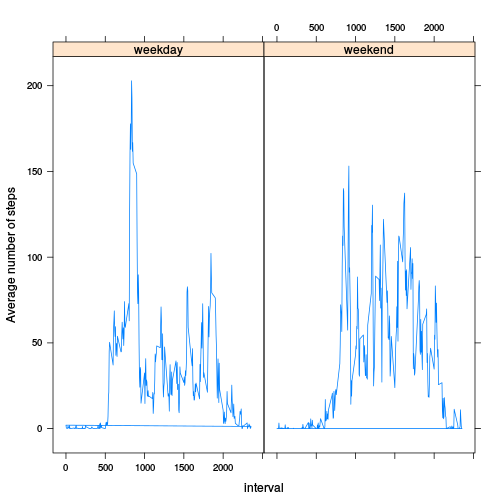

## Loading and preprocessing the data

We download the zip-file from the web to a tempfile.
Then we unzip this file and read the data in.
Finally we recast the dates as dates rather than factors:


```r
temp <- tempfile()
filename <- "activity.csv"
download.file("https://d396qusza40orc.cloudfront.net/repdata%2Fdata%2Factivity.zip", temp)
unzip(temp, filename)
unlink(temp)
activityData <- read.csv(file = filename, header = TRUE, stringsAsFactors = FALSE)
activityData$date <- as.Date(activityData$date)
```


## What is mean total number of steps taken per day?

We use tapply to sum the number of steps for each day.
Then we make a histogram using the base plotting system to show this. 
Then we take the mean and median of the total steps vector and store them:

```r
totsteps <- tapply(activityData$steps,as.factor(activityData$date), sum, na.rm = TRUE)
hist(totsteps, xlab = "Total number of steps per day", col = "red", main = "")
title(main = "Histogram of total number of steps per day", col = "red")
```



```r
meanSteps <- mean(totsteps)
medianSteps <- median(totsteps)
```

The mean number of steps per day was 9354.2295082 and the median number of steps per day was 10395.

## What is the average daily activity pattern?


```r
dailyActPattern <- tapply(activityData$steps, as.factor(activityData$interval), mean, na.rm = TRUE)

 plot(as.integer(names(dailyActPattern)), dailyActPattern, type = "l", col = "steelblue", xlab = "", ylab = "")
 title(main = "Average number of steps in each time interval of the day")
 title(ylab = "Average number of steps", xlab = "Time Interval")
```



```r
 maxInt = names(dailyActPattern)[dailyActPattern == max(dailyActPattern)]
```

The interval with the maximum number of average daily steps is interval 835.

## Imputing missing values


```r
numNas <- sum(!complete.cases(activityData)) 
```
The number of rows with NAs is 2304. 

First we want a procedure for what to do with NA values. In this data set only the step-values are NA. The substitution I choose is to take the mean value for the interval in question and then multiply that with the fraction of the mean step number per day for that particular day. This should not affect the overall statistics of the data too much. We already calulated the mean number of steps per day in meanSteps, we have the mean number of steps per interval in dailyActPattern. We start by creating a copy data set in which we can impute. Then we loop over this data set. If the steps are not NA, we go to the next row. If they are na we impute according to the procedure described above.

```r
activityDataNoNas <- activityData
for (i in 1:nrow(activityDataNoNas)){
        if(!is.na(activityDataNoNas[i,1])){
                next()
        }else{
                thisInt <- as.character(activityData$interval[i])
                thisDate <- as.character(activityData$date[i])
                activityDataNoNas$steps[i] <- dailyActPattern[thisInt]*totsteps[thisDate]/meanSteps
        }       
}
```

With this new data set we repeat our procedure for creating a histogram for total number of steps per day:

```r
totsteps2 <- tapply(activityDataNoNas$steps,as.factor(activityDataNoNas$date), sum)
hist(totsteps2, xlab = "Total number of steps per day", main = "", col = "springgreen")

title(main = "Histogram of total number of steps per day")
```



```r
meanSteps2 <- mean(totsteps2)
medianSteps2 <- median(totsteps2)
```
With this imputing scheme the mean step number per day is 9354.2295082 and the median is 1.0395 &times; 10<sup>4</sup>. 


## Are there differences in activity patterns between weekdays and weekends?
We start by creating the factor variable weekdayOrEnd in the imputed data set. To initialize we set all values to "weekday". Then we loop over the rows and put in "weekend" at the appropriate values. Finally we recast the variable as a factor variable:

```r
weekend <- c("Saturday", "Sunday")

activityDataNoNas$weekdayOrEnd <-"weekday"

for (i in 1:nrow(activityDataNoNas)){
        if(!(weekdays(activityDataNoNas$date[i])%in% weekend)){
                next()
        }else{
                activityDataNoNas$weekdayOrEnd[i] <- "weekend"
        }       
}
activityDataNoNas$weekdayOrEnd <- as.factor(activityDataNoNas$weekdayOrEnd)
```

Then we plot over this per interval for weekends and weekdays. To get this we first need to calculate the average number of steps per interval for weekdays and weekends separately. For convenience when plotting. We add a column in the data set for this value. We then use the lattice package to obtain the plot:

```r
averageStepsPerWeekInterval <- tapply(activityDataNoNas$steps,
                        list(as.factor(activityDataNoNas$interval),activityDataNoNas$weekdayOrEnd), mean)

activityDataNoNas$avgSteps <- activityDataNoNas$steps

for (i in 1:nrow(activityDataNoNas)){
        thisInt <- as.character(activityDataNoNas$interval[i])
        thisDay <- as.character(activityDataNoNas$weekdayOrEnd[i])
        activityDataNoNas$avgSteps[i] <- averageStepsPerWeekInterval[thisInt,thisDay]
}

xyplot(avgSteps~interval|weekdayOrEnd, data = activityDataNoNas, type = "l", ylab = "Average number of steps")
```



